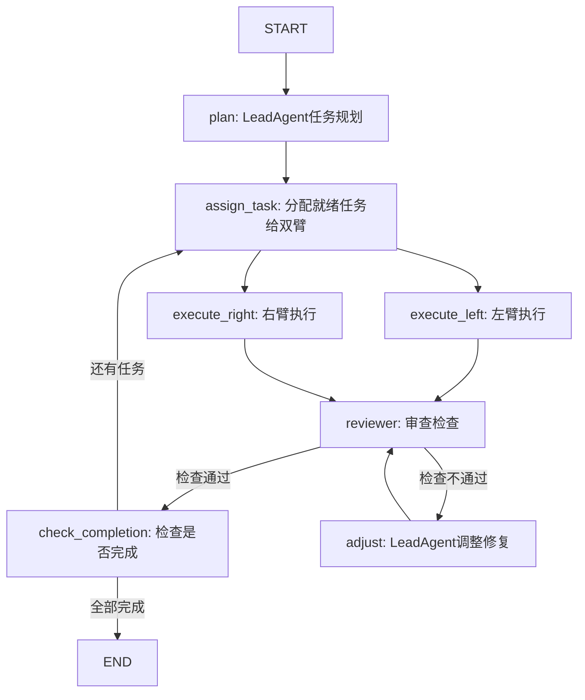

# URrobot-agent - 基于 LangGraph 的双臂机器人多智能体协作控制系统

> 带有自动审查agent的LLM驱动双臂机器人协作系统

## 项目概述

URrobot-agent 是一个**基于大语言模型（LLM）和 LangGraph 的多智能体协作双臂机器人控制系统**，专为 Universal Robots UR5 机械臂设计，主要应用于工业维护场景中的 ORU（Online Replaceable Unit，可更换单元）自动更换任务。

该项目采用**显式图状态流转 + 自动审查**架构，支持双臂异步并行执行，每次操作完成后自动由审查agent检查场景状态一致性，发现问题触发主agent调整。

## 核心特性

| 特性 | 描述 |
|-----|------|
| **自然语言任务理解** | 用户用自然语言描述任务（如"更换装配站上的ORU"），AI自动理解并执行 |
| **LangGraph 显式控制流** | 基于LangGraph的图结构定义执行流程，清晰可控，易于调试 |
| **双臂并行执行** | 左右臂可同时执行无依赖任务，提高执行效率 |
| **自动审查机制** 🆕 | **Reviewer Agent** 每次操作完成后自动检查场景状态一致性 |
| **错误自动恢复** | 审查发现问题自动触发主agent调整，重试直至通过检查 |
| **技能化任务设计** | 预定义原子技能，以Markdown文件存储，易于扩展 |
| **任务依赖管理** | 支持 `blocked_by` 依赖关系，自动按序执行 |
| **任务持久化存储** | 所有任务保存到JSON文件，支持断点续执行 |
| **真实硬件支持** | 通过 RTDE 协议控制真实 UR5 机械臂 |
| **仿真模式** | 无需硬件也可运行仿真调试 |

## 系统架构



### 节点职责

| 节点 | 职责 |
|------|------|
| **plan** | LeadAgent进行任务分解，创建所有任务并设置依赖 |
| **assign_task** | 找出所有就绪任务，分别分配给左右臂（支持并行） |
| **execute_left** / **execute_right** | 左右臂并行执行分配的任务 |
| **reviewer** | 🆕 **Reviewer Agent** 检查场景状态一致性 |
| **adjust** | 如果检查不通过，LeadAgent分析问题并调整修复 |
| **check_completion** | 检查是否所有任务完成，决定继续还是结束 |

### Reviewer Agent 检查清单

每次操作完成后，Reviewer自动检查：

1. ✅ **机械臂状态一致性** - 夹爪闭合必须持有物体，夹爪打开不能持有物体
2. ✅ **物体持有一致性** - 物体标记的持有者必须与机械臂实际持有匹配，不能同时被多个机械臂持有
3. ✅ **碰撞风险检查** - 计算双臂TCP距离，如果小于安全阈值告警
4. ✅ **错误状态检查** - 是否有机械臂处于ERROR状态
5. ✅ **最大重试限制** - 如果多次调整仍不通过，终止任务

## 内置技能（Skills）

项目预置了完整的 ORU 更换任务所需的 **9 个**原子技能：

| 技能名称 | 描述 |
|---------|------|
| `pick-screwdriver` | 从工具架抓取螺丝刀 |
| `loosen-screw` | 拧松装配站螺丝（拆卸前） |
| `tighten-screw` | 拧紧装配站螺丝（安装后） |
| `pick-old-oru` | 从装配站抓取旧ORU |
| `pull-out-oru` | 将旧ORU从装配站拔出 |
| `place-to-storage` | 将旧ORU放置到储物架 |
| `pick-new-oru` | 从储物架抓取新ORU |
| `insert-oru` | 将新ORU插入装配站 |
| `place-screwdriver` | 🆕 将螺丝刀放回工具架原位（螺丝操作完成后） |

## 项目结构

```
URrobot-agent/
├── main.py                    # 命令行主入口（支持架构切换）
├── app.py                     # Streamlit Web可视化界面
├── .env                       # 环境变量配置
├── requirements.txt           # Python依赖
│
├── config/
│   ├── config.json            # 机械臂配置
│   └── object_positions.json  # 物体位置与属性配置
│
├── robot/
│   ├── multi_arm_manager.py   # 多机械臂硬件管理器（不变）
│   ├── task_persistence.py   # 任务持久化存储（不变）
│   ├── skill_loader.py        # 技能文件加载器（不变）
│   ├── tools.py               # 工具注册与执行（不变）
│   ├── lead_agent.py          # 原有LeadAgent（保留兼容）
│   ├── teammate.py            # 原有队友智能体（保留兼容）
│   ├── team.py               # 原有消息总线（保留兼容）
│   ├── langgraph_agent.py     # 🆕 LangGraph高层入口
│   └── graph/                # 🆕 LangGraph新架构
│       ├── __init__.py
│       ├── state.py           # 图状态定义
│       ├── reviewer.py        # 🆕 Reviewer审查检查逻辑
│       ├── nodes.py           # 所有图节点实现
│       └── builder.py         # 图构建与编译
│
├── skills/                    # 原子技能库（Markdown格式）
│   ├── pick-screwdriver/
│   ├── loosen-screw/
│   ├── tighten-screw/
│   ├── pick-old-oru/
│   ├── pull-out-oru/
│   ├── place-to-storage/
│   ├── pick-new-oru/
│   ├── insert-oru/
│   └── place-screwdriver/    # 🆕 新增螺丝刀放回技能
│
└── utils/
    └── logger_handler.py      # 日志处理
```

## 配置说明

### 环境变量 (`.env`)

```env
# API Key (required)
ANTHROPIC_API_KEY=your-api-key

# Model ID
MODEL_ID=minimax-m2.5

# Base URL (for Anthropic-compatible providers)
ANTHROPIC_BASE_URL=https://ark.cn-beijing.volces.com/api/coding

# Robot Configuration
ROBOT_LEFT_HOST=192.168.111.101
ROBOT_RIGHT_HOST=192.168.111.102
USE_SIMULATOR=true

# Architecture Selection 🆕
# - true: LangGraph + Reviewer 双臂并行 + 自动审查（默认）
# - false: 传统多线程+消息总线架构
USE_LANGGRAPH=true
```

### 机械臂与物体配置 (`config/object_positions.json`)

```json
{
  "robots": {
    "arm_left": {
      "name": "Left UR5",
      "host": "192.168.111.101",
      "home_position": [0.3, 0.3, 0.4, 0.0, 3.14159, 0.0],
      "reachable_zones": ["assembly_station", "tool_rack", "storage_rack_left"]
    },
    "arm_right": { ... }
  },
  "objects": {
    "screwdriver": {
      "position": [0.3, -0.2, 0.3, ...],
      "type": "tool",
      "status": "stored"
    },
    ...
  }
}
```

## 安装与运行

### 安装依赖

```bash
pip install -r requirements.txt
```

依赖包：
- `anthropic` - Anthropic Claude API兼容
- `python-dotenv` - 环境变量管理
- `langgraph` - LangGraph图执行框架 🆕
- `langchain-core` - LangChain核心
- `streamlit` - Web可视化界面
- `rtde-control` / `rtde-receive` - UR机器人RTDE通信（真实硬件需要）

### 运行

```bash
python main.py
```

默认使用 **LangGraph + Reviewer** 架构，如果想切回传统架构，修改 `.env` 中 `USE_LANGGRAPH=false`。

### 交互命令

- `quit` / `exit` - 退出程序
- `state` / `状态` - 显示当前工作单元状态
- `reset` / `重置` - 重置所有机械臂和任务
- `help` / `帮助` - 显示帮助

## 使用示例

**用户输入**:
```
> 更换装配站上的ORU
```

**规划结果** (LeadAgent):
1. 创建任务 #1 `pick-screwdriver` (left_arm)
2. 创建任务 #2 `loosen-screw` (left_arm, blocked_by: #1)
3. 创建任务 #3 `pick-old-oru` (left_arm, blocked_by: #2)
4. 创建任务 #4 `pull-out-oru` (left_arm, blocked_by: #3)
5. 创建任务 #5 `place-to-storage` (left_arm, blocked_by: #4)
6. 创建任务 #6 `pick-new-oru` (right_arm, 可与#5并行)
7. 创建任务 #7 `insert-oru` (right_arm, blocked_by: #6)
8. 创建任务 #8 `tighten-screw` (left_arm, blocked_by: #5 #7)
9. 创建任务 #9 `place-screwdriver` (left_arm, blocked_by: #8) ← 新增螺丝刀放回

**执行流程**:
- `assign_task` 发现 #1 就绪，分配给 `left_arm`，没有其他就绪任务
- `execute_left` 执行 #1，`execute_right` 无任务跳过
- **两个分支都完成**后进入 `reviewer` 检查
- 检查通过 → `check_completion` → `assign_task` 下一回合
- ...
- 当进行到 #5 `place-to-storage` (left_arm) 和 #6 `pick-new-oru` (right_arm) → **两个任务都就绪，** **同时并行执行**
- 两个都完成 → 一起进入 `reviewer` 统一检查

## 设计亮点

### 1. **LangGraph 显式控制流**
相比原来的多线程+消息总线隐式控制流，LangGraph将执行流程显式定义为图节点和边，调试更容易，流程清晰可见。

### 2. **自动审查机制** 🆕
每次操作（包括双臂并行操作）完成后，自动由独立Reviewer Agent检查整个场景状态一致性，提前发现问题，避免错误累积。

### 3. **原生支持并行执行**
LangGraph原生支持一个节点多个出边并行执行，等待全部完成再继续，天然适配双臂并行执行场景。

### 4. **Skill-based 架构**
相比硬编码操作步骤，将技能文档化存储在Markdown中，LLM可以直接读取并按步骤执行，易于扩展和修改。添加新技能只需新增一个SKILL.md文件，无需修改代码。

### 5. **层级多智能体**
- LeadAgent专注于高层规划、依赖设置、错误调整
- 每个机械臂执行节点专注于具体动作执行
- Reviewer专注于状态检查
- 职责分离清晰

### 6. **任务持久化**
所有任务保存到文件，系统重启后可以恢复执行进度，适合工业场景。

## 新增改动对比原架构

| 特性 | 原架构 | 新LangGraph架构 |
|------|--------|----------------|
| 控制流 | 多线程+消息总线，隐式 | LangGraph显式图，清晰可控 |
| 并行执行 | 每个队友独立线程，需要显式消息同步 | 原生支持并行，自动等待全部完成 |
| 自动审查 | ❌ 无 | ✅ Reviewer每次操作后自动检查 |
| 错误恢复 | 需要Lead主动inbox读取，流程复杂 | ❗ 检查不通过自动路由到adjust节点 |
| 可调试性 | 多线程难调试 | 单线程线性执行，易于调试 |
| 螺丝刀归位 | ❌ 缺少 | ✅ 新增 `place-screwdriver` 技能 |
| 并行规划引导 | 不足，容易全顺序阻塞 | ✅ 提示词改进，引导正确识别可并行任务 |

## 常见问题

**Q: 什么时候Reviewer会检查不通过？**

A: 常见场景：
- 机械臂夹爪状态与持有物体不一致（夹爪闭了没抓到东西）
- 物体持有者信息不匹配
- 双臂距离太近可能碰撞
- 某个机械臂进入错误状态

**Q: 检查不通过之后怎么办？**

A: 自动路由到 `adjust` 节点，由LeadAgent分析问题并执行修复操作（比如重新打开/关闭夹爪，更新物体状态，回滚任务重新执行），调整完成后再次检查，直到通过或达到最大重试次数。

**Q: 如何切换回原有架构？**

A: 修改 `.env` 文件中 `USE_LANGGRAPH=false` 即可，原有代码完全保留。

## 许可证

MIT
